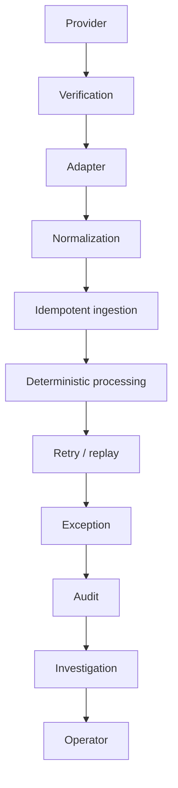

# Architecture

HOOKX is a payment webhook reliability engine. Provider deliveries are verified, normalized, stored once, and applied through a deterministic state machine. Operators inspect failures. AI may explain evidence. AI does not change financial state.

## System boundaries

| Layer | Responsibility | Must not |
| --- | --- | --- |
| Provider adapter (`@hookx/webhook`) | Signature scheme, payload parse, normalize | Own payment transitions |
| HTTP API (`apps/api`) | Raw body, correlation id, route to ingest | Own transition rules |
| Domain (`@hookx/domain`) | Money, ids, payment states | Import UI, HTTP, DB, AI |
| Processing (`@hookx/state-machine`) | `processEvent`, `replayEvents` | Import DB or AI |
| Persistence (`@hookx/storage`) | Events, payments, retries, audit, exceptions | Decide transitions |
| Exceptions (`@hookx/exceptions`) | Deterministic classification | Call AI or mutate money with floats |
| Investigation (`@hookx/investigation`) | Read-only explanation | Write payments or audit as financial decisions |
| Operator console (`apps/web`) | Display persisted state | Invent metrics or mutate ledger |

Razorpay-specific code lives under `packages/webhook/src/razorpay/`. The core engine does not assume Razorpay field names.

## Data flow



Ingestion in order: capture raw body → verify signature → adapter normalize → idempotent persist → process / replay → durable payment + audit → HTTP response.

```
Provider
  → Verification
  → Adapter
  → Normalization
  → Idempotent ingestion
  → Deterministic processing
  → Retry / replay
  → Exception
  → Audit
  → Investigation
  → Operator
```

## Retries and replay

A persisted event that fails temporarily is claimed (`SELECT … FOR UPDATE SKIP LOCKED`), retried with deterministic backoff, and dead-lettered after max attempts or a permanent failure. Replay is explicit: stored events are ordered and passed through `replayEvents`. Replay does not delete or overwrite webhook identity rows and does not invent transitions.

## Audit and investigation

`audit_events` is append-only from application writes. Covered operations include ingest, processing decision, exception, retry, replay, and investigation recording. Investigation reads sanitized evidence and records `INVESTIGATION_RECORDED`. Payment rows are unchanged by that write.

## Before production

HOOKX is a local reliability engine and operator workspace. It is not a production payment processor. Gaps include authentication, rate limiting, provider onboarding, secret rotation, operational alerting, high availability, load testing, live Razorpay webhook verification, and deployment infrastructure. See [docs/reviewer-guide.md](reviewer-guide.md).

## Operator surface

Primary navigation: Overview, Demo, Failure Lab, Incidents. Exception, payment, and event pages remain as linked investigation routes. Overview metrics, when shown, come from `GET /metrics/summary` persisted counts. Missing data is **NO DATA**, not a fabricated reliability percentage.
